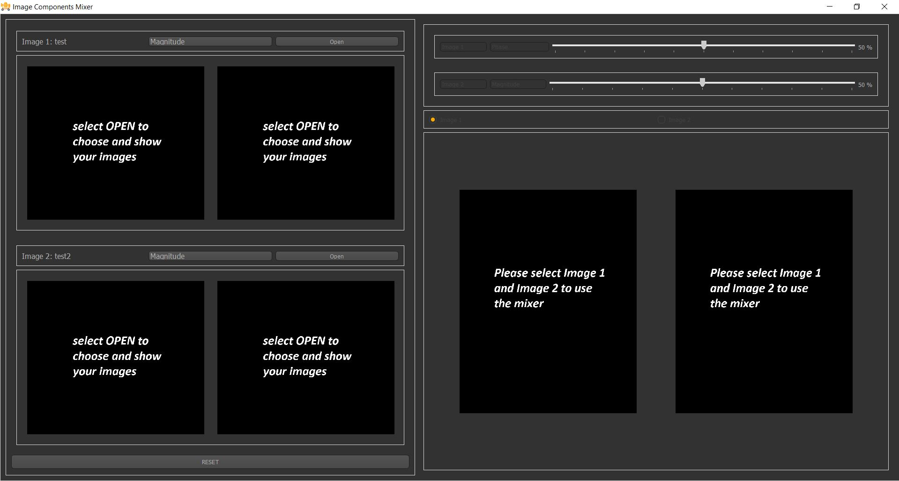
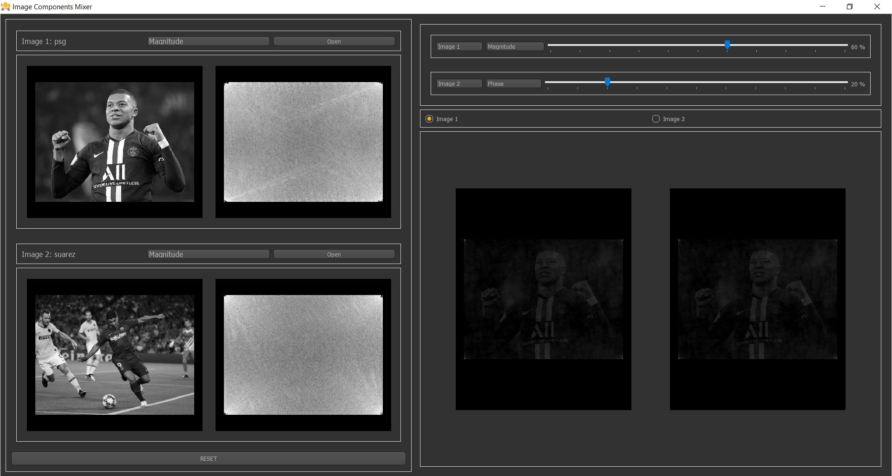
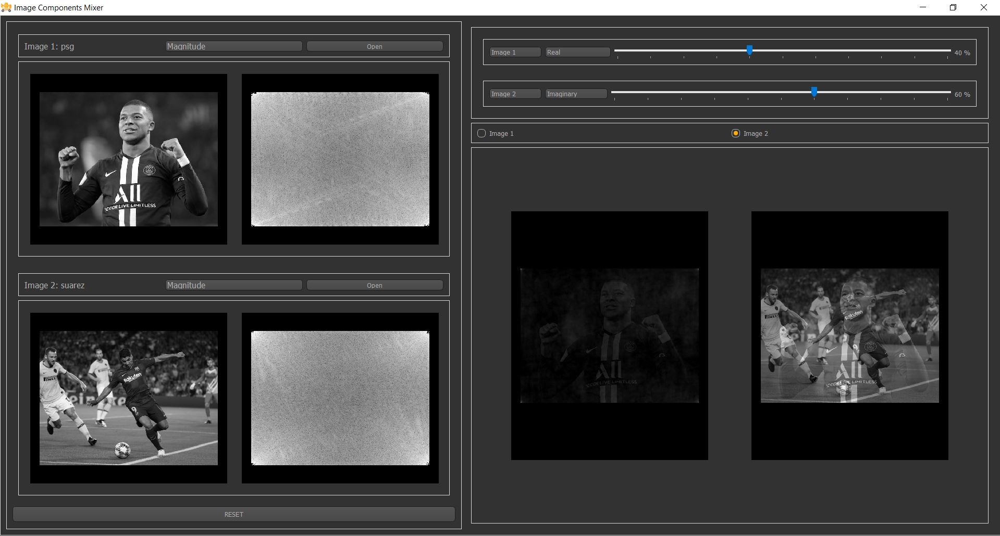
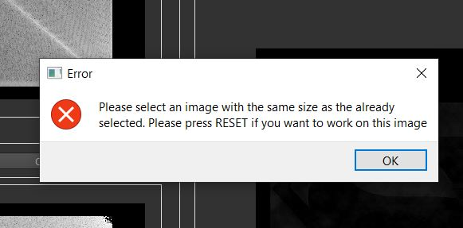
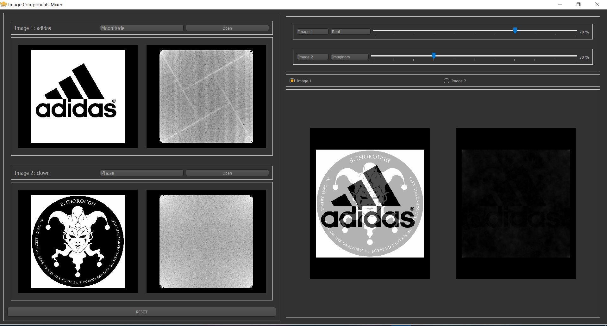
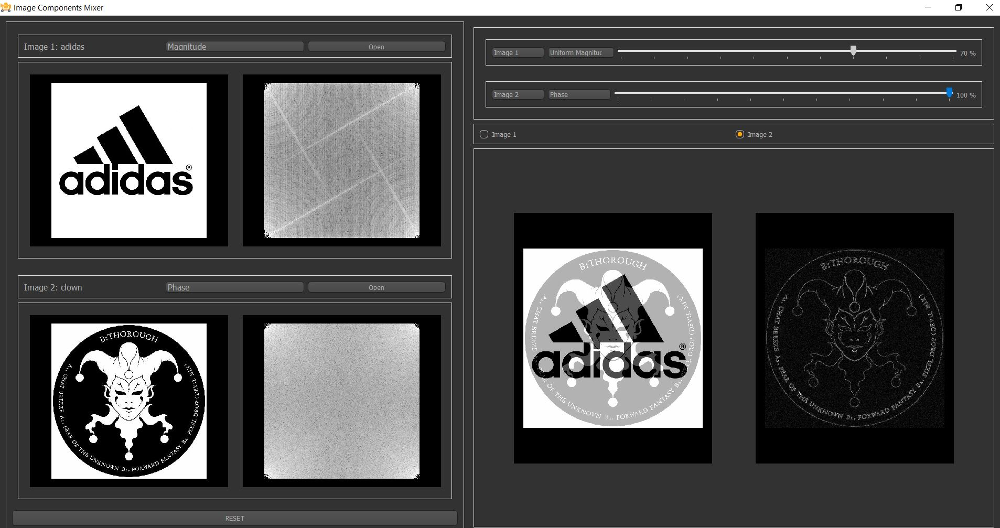
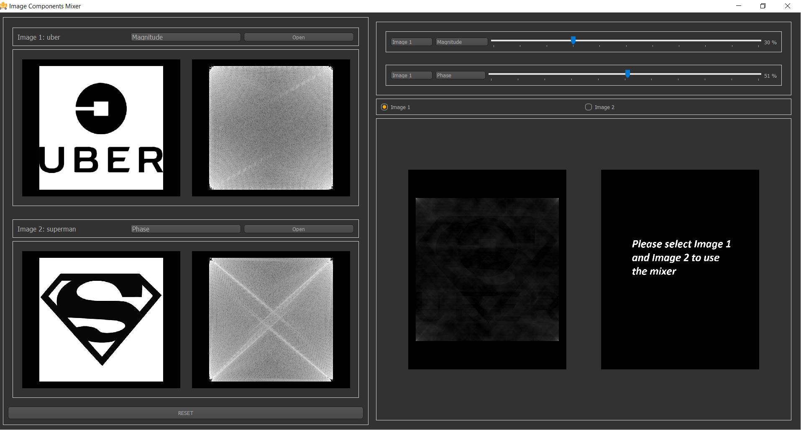
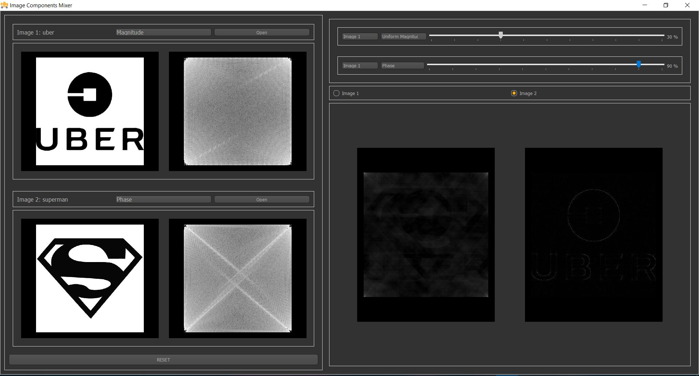

### Name: Ahmed Khaled Mohamed Salah
### ID: 4

# MagnitudePhaseMixerTemplate

## Screenshots
### 1. Openning Screen:

### 2. Test 1

### 3. Error Message 
* It shows when the user tries to open an image that its size isn't compatible with the image that was selected first

### 4. Test 2

### 5. Test 3

