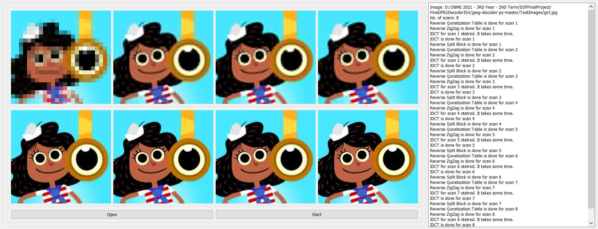
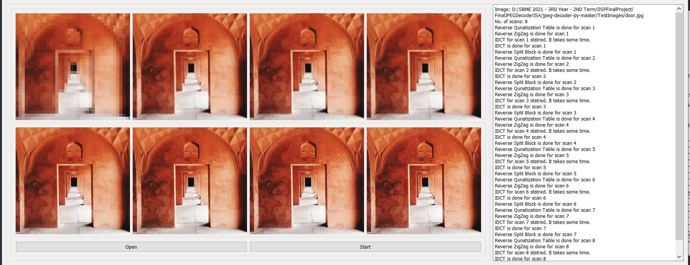
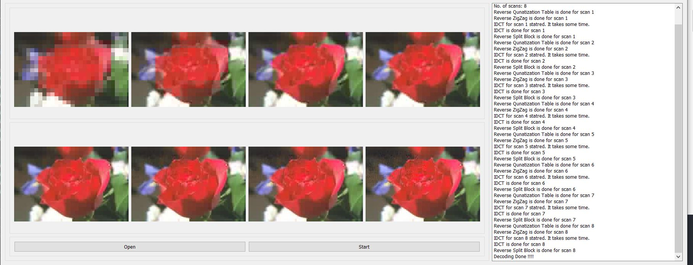
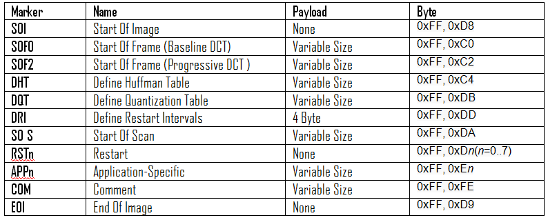
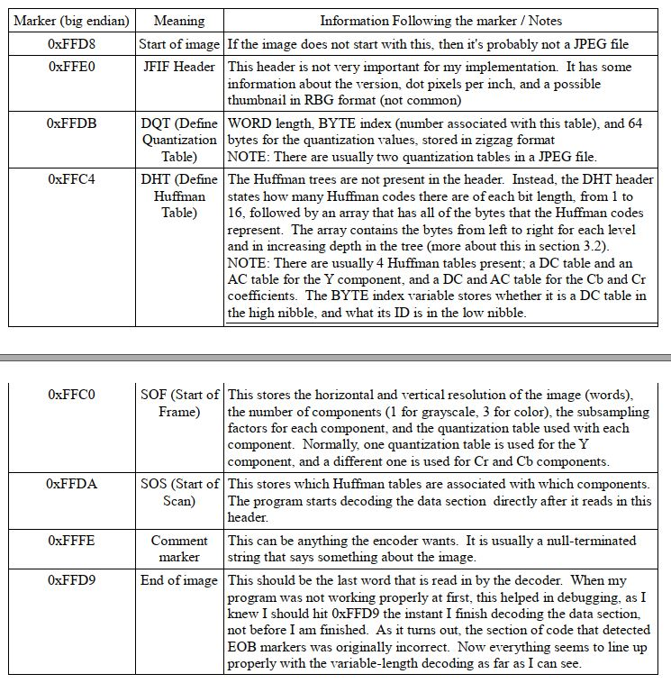
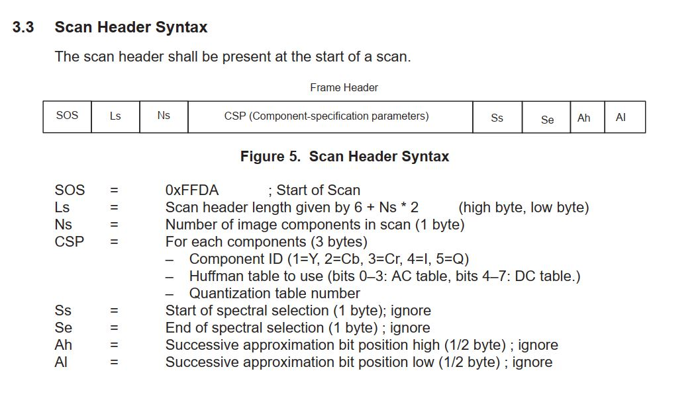
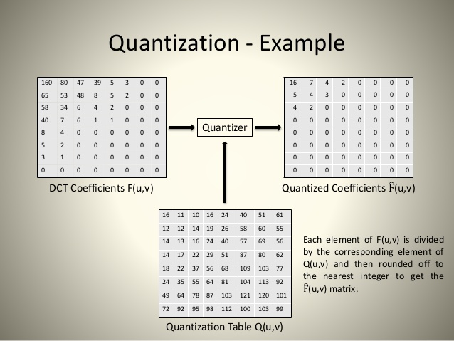
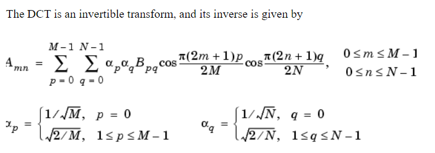

## JPEG Decoding

## Table Of Contents
1. [GUI](#gui)<br>
   a. [NOTE](#note)<br>
   b. [Tests](#tests)<br>
2. [Reading the JPEG](#reading-the-jpeg)<br>
    a. [Reading Quantization Tables](#reading-quantization-tables)<br>
    b. [Reading the Huffman Trees](#reading-the-huffman-trees)<br>
    c. [Reading the image information](#reading-the-image-information)<br>
    d. [Scanning Data](#scanning-data)<br>
3. [Decoding Extracted Data](#decoding-extracted-data)<br>
    a. [Reverse Quantization Tables (Dequantization)](#reverse-quantization-tables-dequantization)<br>
    b. [Inverse Discrete Cosine Transform (IDCT)](#inverse-discrete-cosine-transform-idct)<br>
    c. [Combining Blocks (MCUs)](#combining-blocks-mcus)<br>

#### GUI    


##### Tests
For Progressive images can be found in ```ProgressiveImages``` folder



* Progressive images are decoded into 8 scans and each scan is shown in each block. OPEN button opens a window to select the image. START button starts the decoding process explained in detail [here](#decoding-extracted-data).
* When each scan segment of the jpeg are decoded. The resulted image is shown on one of the image blocks (depending on the index). The images when decoded are saved in the ```OP``` directory for better tracking of the resolution difference between each scan specially for large images.
* A logging text are is also added to show the status of the operations (Inverse Quantization, Inverse ZigZag, IDCT, Iverse Block Split) whether they started or finished.

#### Reading the JPEG
* We read the JPEG as bytes through ```open(image, 'rb').read()``` which return an iteratable string representing the bytes of the file in hex form.
* The data of the JPEG file contains quantization tables for each component, the huffman trees, the scans of the image (from low resolution to the highest resolution), some information about the frequency precision of each component, width, height, etc.
* To specify each data segment, markers are used between each data segment. Markers are added into dictionary (for easier debugging).


* We loop on the data until we reach a marker and depending on it we call a function implemented for each data segmeent.

```python
if marker_type in marker_dict:
    if marker_type == EOI:
        break
    elif marker_type == SOI:
        continue
    elif marker_type == DHT:
        self.readHuffmanTable()
    elif marker_type == DQT:
        self.readQT()
    elif marker_type == SOF0 or marker_type == SOF2:
        self.readFrame(mode=marker_type)
    elif marker_type == SOS:
        self.ReadScan()
        self.scan += 1
        if self.mode == SOF0:
            break
    elif marker_type == APP0 or marker_type == APP1:
        length = self.readTwoBytes()
        self.pos += length - 2
        print(length)
```

##### Reading Quantization Tables
If we reach the marker DQT(0XDB), we call the function ```readQT``` start adding the 64 values to our quantization tables. We assign the quantization table for each component (Y, Cb, Cr) depending on the identifer read by the function.

```python
 def readQT(self):
        """
        readQT: reading the quantization table of each component
        """
```

##### Reading the Huffman Trees
Now we reach the marker DHT(0XC4), we first read the bits (codewords) and values for each and build our Huffman Tree using the ```create_huffman_tree``` function and depending on the root assigned for each component we decode the compressed bits of each value.
```python
def readHuffmanTable(self):
    """
    readHuffmanTable: reading after reaching huffman marker each component's huffman
                      tree of each value and code representation
    """
```

##### Reading the image information
When reaching either marker (SOF0-0XC0 for baseline) or (SOF2-0XC2 for progressive), we reached the frame of the image where we can extract information about the imager regarding the width and height, the sample precision of each component, number of components (usually 3), the width and height of the minimum coded unit (MCU).

```python
def readFrame(self, mode):
    """
    readFrame: reading important information about the image regarding its mode, the frequency and precision of each component
    :param mode: BASELINE/PROGRESSIVE
    """
```

##### Scanning Data
* After extracting the quantization tables, Huffman trees, and Frame data, we start getting the scans of the image (usually from 8-10). The first scanned data represent the DC component with low-resolution data, the following represent part of the AC data, the next scan adds more data. every scan adds more data until we reach the final scan which should include with the previous data the full-resolution data.
* We classify the data into DC or AC and First or Subseqeunt depending on the Ss, Se, Ah, Al bits.


```python
if self.mode == SOF0: # sequential
    return
elif self.mode == SOF2: # progressive
    if Ss == 0:
        if Ah == 0: # DC first scan
            self.decode_DC_progressive_first(interleaved_components, Al)
        else: # DC subsequent scan
            self.decode_DC_progressive_subsequent(interleaved_components, Al)
    elif Ah == 0: # AC first scan
        self.decode_ACs_progressive_first(interleaved_components, Ss, Se, Al)
    else: # AC subsequent scan
        self.decode_ACs_progressive_subsequent(interleaved_components, Ss, Se, Al)
```

#### Decoding Extracted Data
After extracting the data from the JPEG file we apply four steps; Dequantization, Reverse ZigZag, inverse DCT, combining of the blocks(MCUs). No need for the color transform from YCbCr to RGB thanks to PIL Image class which can recieve data with any color system.

```python
def decodeComponents(self, i):
    """
    decodeComponents: taking read info of the jepg and applying the steps of converting this data into image data
    :param i: the index of the component [scan] to be decoded
    """
    components = self.dataList[i]
    self.reverseQT(components)
    self.text.append("Reverse Qunatization Table is done for scan {}".format(i))
    QApplication.processEvents()
    self.reverseZigZag(components)
    self.text.append("Reverse ZigZag is done for scan {}".format(i))
    QApplication.processEvents()
    self.reverseDCT(components)
    self.text.append("Reverse DCT is done for scan {}".format(i))
    QApplication.processEvents()
    self.reverseSplitBlock(components)
    self.text.append("Reverse Split Block is done for scan {}".format(i))
    QApplication.processEvents()
    newpath = self.save()
    return newpath
```

##### Reverse Quantization Tables (Dequantization)
The quantization tables are 8x8 values matrix that to be multiplied with the decoded scanned data extracted. The resulted values are the DCT values.


```python
def reverseQT(self, components):
        for cp in components.values():
            for i in range(cp.nr_blocks_ver):
                for j in range(cp.nr_blocks_hor):
                    for k in range(64):
                        cp.blocks[i][j][k] *= cp.qt[k]
```


##### Inverse Discrete Cosine Transform (IDCT)
After dequantization, we apply the IDCT as the data we have right now is the contribution for a set of 64 frequencies. We use the equations in the figure below.


```python
def alpha(x):
    return 1/2 if x != 0 else 1/math.sqrt(8)

def IDCT(F, x, y):
    res = 0
    for u in range(8):
        for v in range(8):
            res += alpha(u) * alpha(v) * F[u][v] * math.cos(math.pi*u*(2*x+1)/16) * math.cos(math.pi*v*(2*y+1)/16)
    return res
```
However using idct in scipy.fftpack is much better in time consumption
```python
def IDCT_matrix(F):
    f = np.clip(np.matrix.round(idct(idct(F, axis=0, norm='ortho'), axis=1, norm='ortho') + 128), 0, 255)
``` 

##### Combining Blocks (MCUs)
The MCUs are combined to fit the image through the stuffed height and stuffed width. The blocks are then saved into images (for better debugging) int the OP directory.

